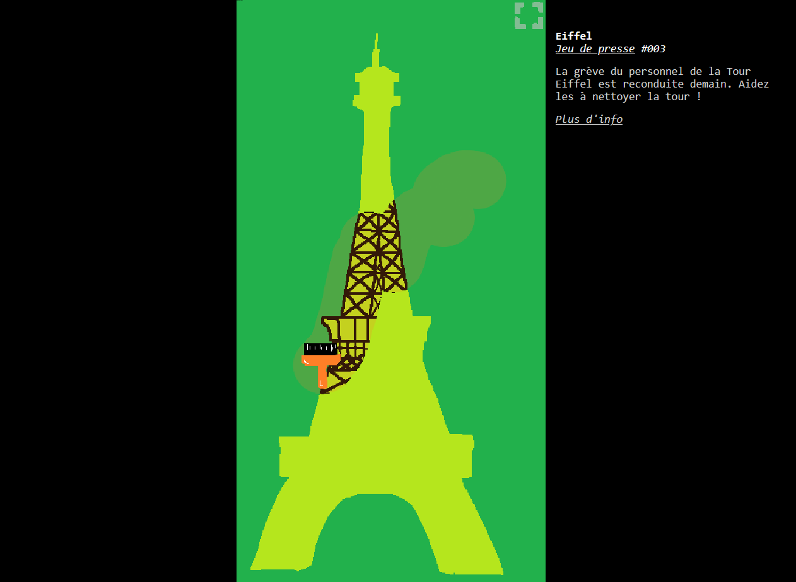

Jeu de presse
=============

Ce dépôt regroupe toutes nos tentatives de *jeux de presse*, c'est-à-dire de dessins d'actualité interactifs.

L'objectif est de produire **très rapidement** un objet interactif traitant d'actualité, potentiellement avec légèreté et décalage, plus que de construire un véritable jeu. À ce titre, nous nous imposons de produire tous les visuels uniquement à l'aide de MS Paint, afin de ne pas être tenté d'y passer trop de temps (et pour en profiter pour fair un clin d'oeil aux *Paint Games* de [Rémy Sohier](https://www.remysohier.com/)).

Explorez les différents dossier pour y découvrir tous ces jeux/jouets !

 - **001** [Robert](https://eliemichel.github.io/JeuDePresse/Robert) *11 février 2024* [[lien alternatif]](https://www.exppad.com/games/JeuDePresse/Robert) [[source]](https://github.com/eliemichel/JeuDePresse/tree/main/Robert)

 - **002** [Alexeï](https://eliemichel.github.io/JeuDePresse/Alexei) *19 février 2024* [[lien alternatif]](https://www.exppad.com/games/JeuDePresse/Alexei) [[source]](https://github.com/eliemichel/JeuDePresse/tree/main/Alexei)

 - **003** [Eiffel](https://eliemichel.github.io/JeuDePresse/Eiffel) *19 février 2024* [[lien alternatif]](https://www.exppad.com/games/JeuDePresse/Eiffel) [[source]](https://github.com/eliemichel/JeuDePresse/tree/main/Eiffel)

 - **004** [Train](https://eliemichel.github.io/JeuDePresse/Train) *27 février 2024* [[lien alternatif]](https://www.exppad.com/games/JeuDePresse/Train) [[source]](https://github.com/eliemichel/JeuDePresse/tree/main/Train)

**NB** *Le lien alternatif est moins mis mis à jour, mais est utile lorsque le lien principal est trop lent.*

Auteurs
-------

 - Élie Michel
 - Félix David-Rivière
